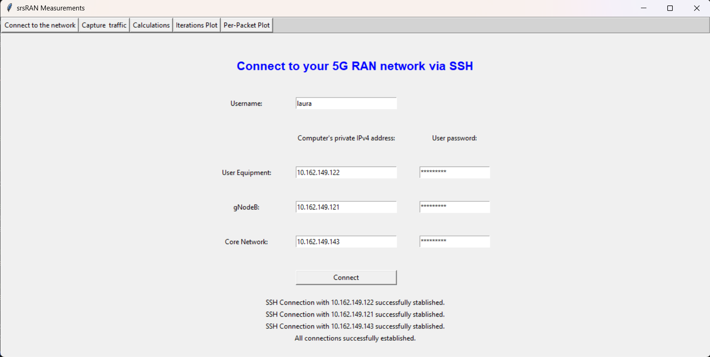
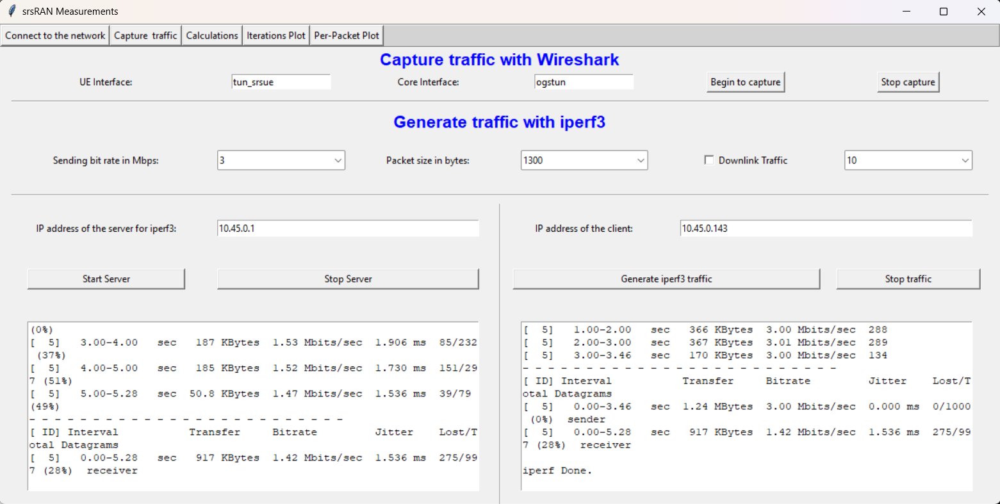
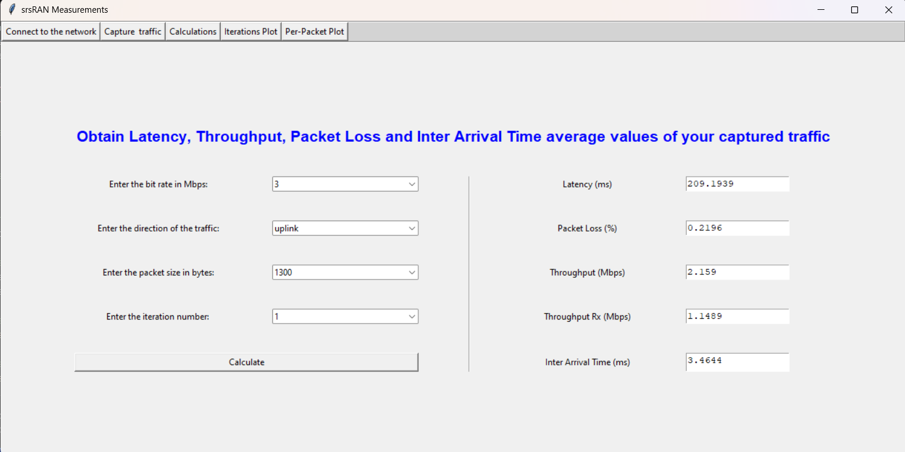
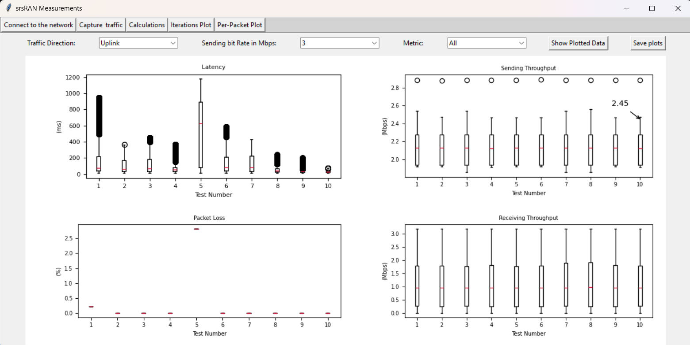
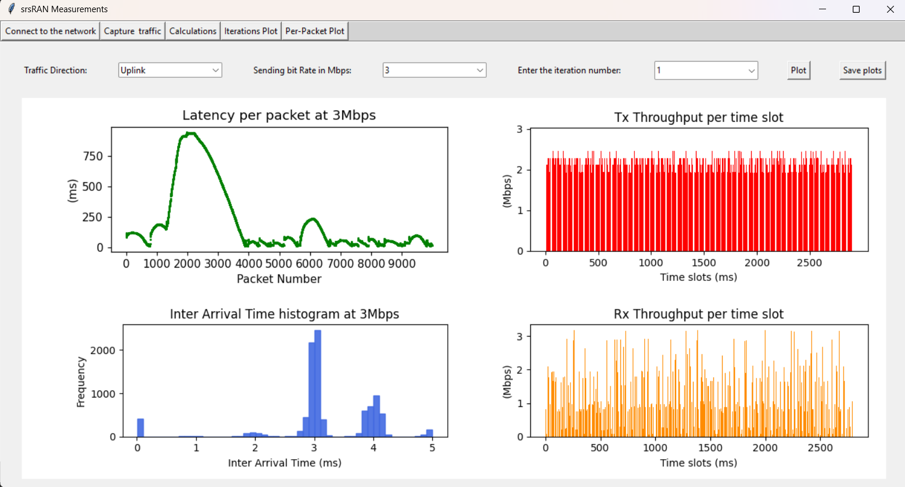

# GUI for Performance Evaluation of srsRAN

This graphical user interface (GUI) was implemented by Laura Rueda García as part of a bachelor thesis titled "Performance Evaluation of srsRAN".

## Purpose

The GUI serves as a measurement tool that allows users to obtain data on four key metrics: latency, throughput, packet loss, and inter-arrival time. This provides valuable insights into the performance of a 5G network.

The way it works is the following: traffic is generated in both uplink and downlink directions from User Equipment to Core Network and viceversa, and then it is captured to be examined.

After some calculations the user can obtain plotted results of the key metrics for his/her private 5G network.

  

## Views

The GUI consists of five main views:

1. **Connect to the Network**: Establish an SSH connection to the 5G network.
2. **Capture Traffic**: Generate and capture network traffic using iperf3 and Wireshark.
3. **Calculations**: Perform calculations on the captured data to obtain average values of the key metrics.
4. **Iteration Plots**: View the results of the calculations in a graphical format.
5. **Plot Per-Packet**: Visualize the data on a per-packet basis using detailed graphs.

To use the GUI, follow these steps:

## Connect to the Network:

 - You need to use ssh (for example have ssh server installed in your three remote PCs and something OpenVPN in your local computer where you use the GUI).
 - Navigate to the "Connect to the Network" view, enter your credentials to connect to the three remote PCs. This is for example, your Ubuntu user name and password. Enter the IP address of the three PCs.
 - Click on "Connect".

## Capture Traffic: 

Go to the "Capture Traffic" view. First you need to fill the parameters:

- Fill the network interface names, these correspond to the ones for the User plane traffic (UE: tun_srsue and core: ogstun).
- Fill the parameters choice for the traffic that you want to send (Bit rate, packet size, traffic direction, and iteration number (1-10))
-Fill the IPv4 adresses needed to send traffic. Core IP address is always 10.45.0.1 and UE's IP address changes everytime it gets a PDU session, and it will be something like 10.45.0.x.

Once all the parameters are filled, it is time to start wireshark and generate the traffic:

- Start wireshark on both Core Network and UE PCs by clicking on "Begin to capture" button.
- Start the server side for the iperf3 traffic generation by clicking on "Start Server"
- Start the traffic by clicking on "Generate iperf3 traffic".

Once the iperf3 traffic is done, the trace will appear on the view in the blank boxes.

- Click on "Stop capture" and all traffic will be saved to two .pcap files in your local directory.
- Click on "Stop Server" if you are not going to send any more traffic. 

The button for "Stop traffic" is not always needed, only in the cases of the UE disconnecting from the network before the iperf3 traffic generation has finished. This happens frequently when sending traffic in the downlink direction.

## Perform Calculations: 

Move to the "Calculations" view. 

- Here choose the combination of parameters of the traffic you saved, don't forget the iteration number.
- Click on "Calculate" and the GUI will take the 2 .pcap files (UE and Core) and do the calculations. Only the first 10,000 packets from each pcap will be used for the calculations.  

On screen you will see the average values for all the key metrics. It takes a few minutes!!.

Besides, for each metric, a file with all the values (for each packet) will also be generated for future plotting, and save in your local directory. 

## View Iteration Plots:

 Check the "Iteration Plots" view. This view is useful if you generated traffic more than once, more than 1 iteration. Here you can see the differences between each iteration. 

- Choose the parameters again to see the results of your generated traffic.
- In the "metric" box you can choose between: latency, packet loss, inter arrival time, all metrics and a comparison between sending and receiving throughput.

## Plot Per-Packet:

 Finally, use the "Plot Per-Packet" view to visualize the data on a per-packet basis.

This GUI is useful but it can also not be very intuitive. If you have any questions: ruedagarcialaura1502@gmail.com 

