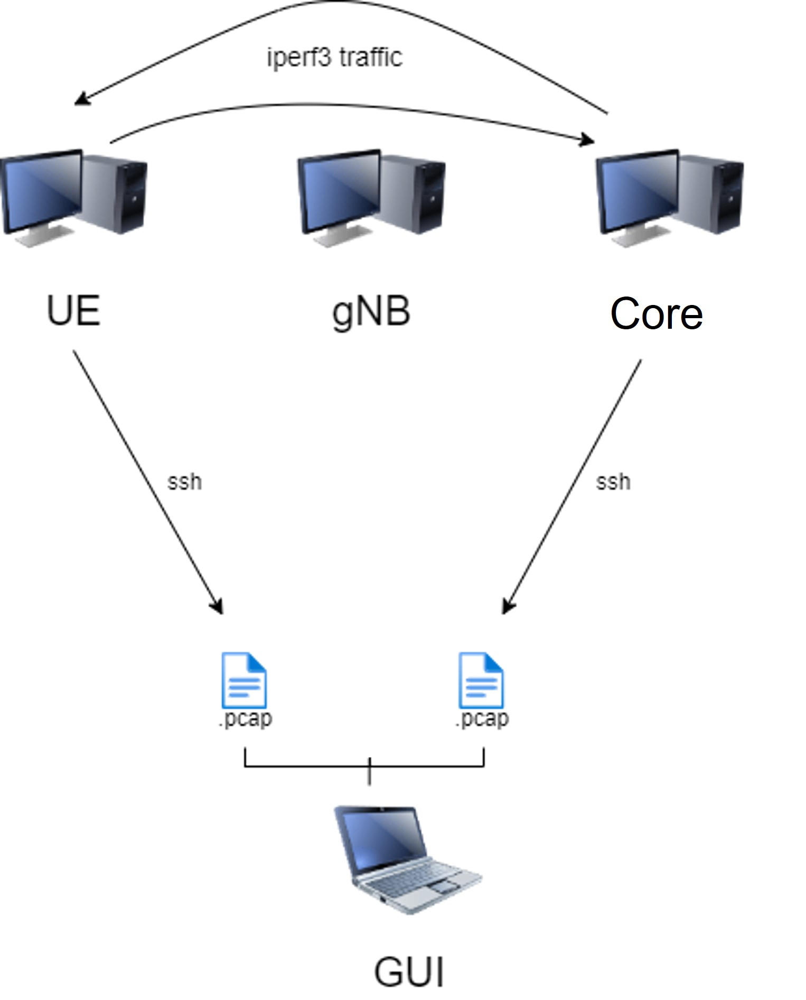

# GUI for Performance Evaluation of srsRAN

This graphical user interface (GUI) was implemented by Laura Rueda García as part of a bachelor thesis titled "Performance Evaluation of srsRAN".

## Purpose

The GUI serves as a measurement tool that allows users to obtain data on four key metrics: latency, throughput, packet loss, and inter-arrival time. This provides valuable insights into the performance of a 5G network.

  
  

## Features

- **Connect to 5G Network**: The GUI allows you to connect to your 5G network using SSH.
- **Generate and Capture Traffic**: You can generate traffic on the network using iperf3 and capture it with Wireshark.
- **Perform Calculations**: The GUI processes the information stored in the two .pcap files and calculates the average values of the key metrics.
- **Visualize Results**: The results can be viewed in a more graphical or visual manner using boxplots and various graphs that show data packet by packet.

## Views

The GUI consists of five main views:

1. **Connect to the Network**: Establish an SSH connection to the 5G network.
2. **Capture Traffic**: Generate and capture network traffic using iperf3 and Wireshark.
3. **Calculations**: Perform calculations on the captured data to obtain average values of the key metrics.
4. **Iteration Plots**: View the results of the calculations in a graphical format.
5. **Plot Per-Packet**: Visualize the data on a per-packet basis using detailed graphs.

## Usage

To use the GUI, follow these steps:
1. **Connect to the Network**: Navigate to the "Connect to the Network" view and establish an SSH connection.
2. **Capture Traffic**: Go to the "Capture Traffic" view to generate and capture network traffic.
3. **Perform Calculations**: Move to the "Calculations" view to process the captured data and calculate the key metrics.
4. **View Iteration Plots**: Check the "Iteration Plots" view to see the average values of the key metrics.
5. **Plot Per-Packet**: Finally, use the "Plot Per-Packet" view to visualize the data on a per-packet basis.

For more detailed information, please refer to the user manual or contact the author.